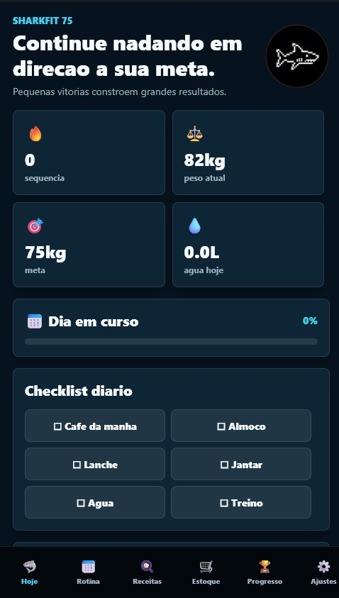
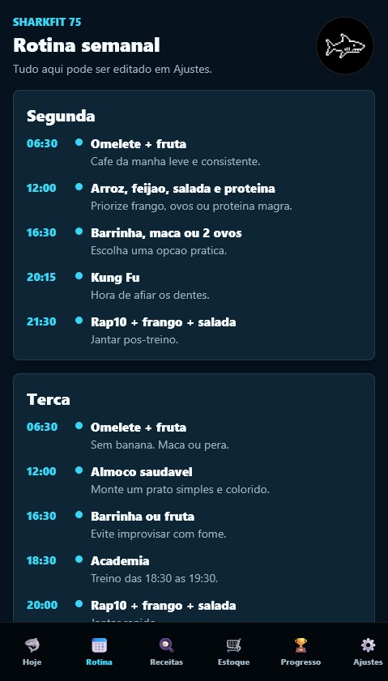
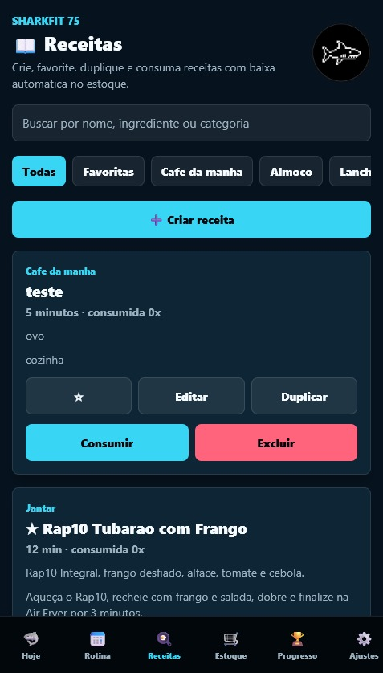
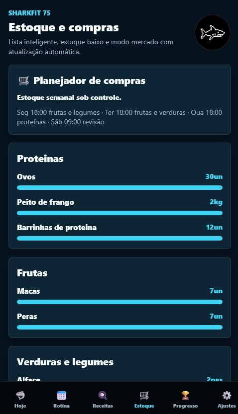
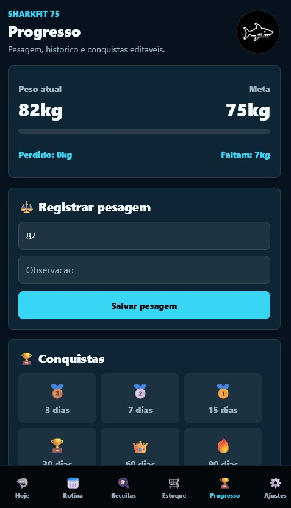
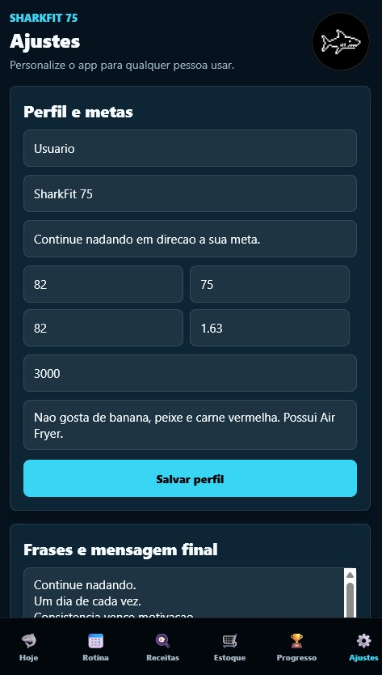

<p align="center">
  
</p>

<h1 align="center">🦈 SharkFit 75</h1>

<p align="center">
Aplicativo mobile desenvolvido em <b>React Native</b> para auxiliar no gerenciamento de treinos, alimentação e evolução física, funcionando <b>100% offline</b>.
</p>

<p align="center">


</p>

<p align="center">


</p>

---

# 📱 Sobre

O **SharkFit 75** é um aplicativo mobile desenvolvido em **React Native + Expo** com o objetivo de auxiliar usuários na organização da rotina fitness através do gerenciamento de treinos, alimentação, receitas e acompanhamento da evolução física.

Todo o aplicativo foi desenvolvido para funcionar **100% offline**, armazenando os dados localmente no dispositivo, garantindo rapidez, privacidade e independência de conexão com a internet.

---

# ✨ Funcionalidades

* 🏋️ Cronograma de treinos
* 🍽️ Planejamento alimentar
* 📖 Cadastro de receitas
* 🔔 Lembretes personalizados
* 📈 Acompanhamento da evolução física
* 💾 Armazenamento local dos dados
* 📴 Funcionamento 100% offline
* 📱 Interface moderna e intuitiva

---

# 🚀 Tecnologias

* ⚛️ React Native
* 🚀 Expo
* 🔷 TypeScript
* 🗄️ SQLite
* 💾 AsyncStorage

---

# 📷 Screenshots

<p align="center">





</p>

<p align="center">





</p>

---

# 🎥 Demonstração

<p align="center">

https://github.com/user-attachments/assets/bbe9d667-48f7-4396-b37d-6f9a21e59651

</p>

---

# ⚙️ Como executar

```bash
# Clonar o projeto
git clone https://github.com/FiscarelliWhas/sharkfit-mobile.git

# Entrar na pasta
cd sharkfit-mobile

# Instalar dependências
npm install

# Executar o projeto
npx expo start
```

---

# 🎯 Objetivo

O SharkFit foi desenvolvido como um projeto de portfólio com foco em arquitetura mobile, organização de código e experiência do usuário, demonstrando a utilização do ecossistema React Native para construção de aplicações completas com armazenamento local.

---

# 👨‍💻 Desenvolvido por

<p align="center">

**Whaslya Fiscarelli**

Software Developer • ERP • Mobile

<a href="https://github.com/FiscarelliWhas">GitHub</a> • <a href="https://www.linkedin.com/in/whaslya-fiscarelli">LinkedIn</a>

</p>

---

<p align="center">
⭐ Gostou do projeto? Deixe uma estrela no repositório.
</p>
